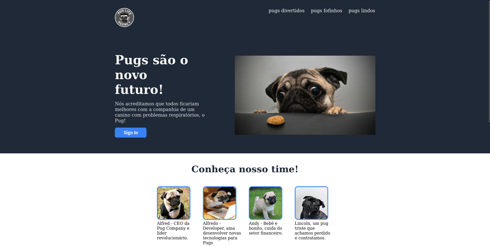

<h1 align="center">Odin Landing Page</h1>

This is a web project made with HTML and CSS for studying purposes

This app is on V1.0

</img>

### Tools

The following tools have been used in the project:

- [HTML](https://html.com/)
- [CSS](https://developer.mozilla.org/pt-BR/docs/Web/CSS)
- [VS Code](https://code.visualstudio.com)
---
### Author
Made by Johan Stromberg :fire:

---
#### [Live Server](https://logzin.github.io/odin-landing-page/)
<h4 align="center">
  🚧  Work In Progress...  🚧
</h4>
